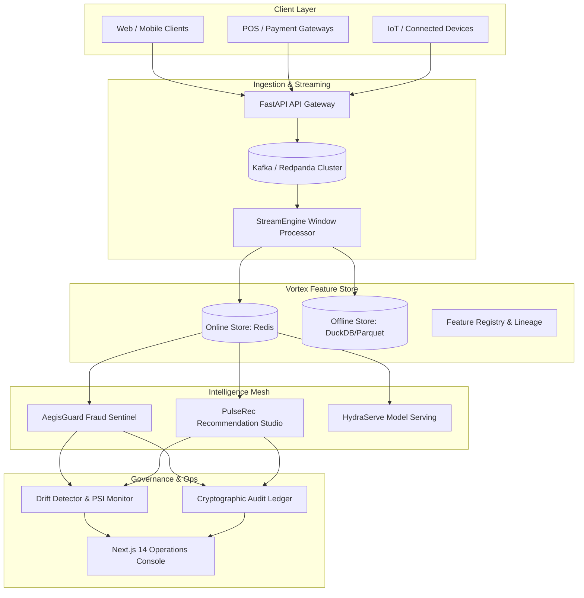

# AegisFlow AI: Enterprise Real-Time Fraud Sentinel & Recommendation Mesh

[](https://www.python.org/downloads/)
[](https://nextjs.org/)
[]()
[]()
[]()
[]()

**AegisFlow AI** is a production-grade, distributed streaming intelligence platform engineered for Tier-1 financial institutions, e-commerce marketplaces, and high-frequency digital ecosystems. It delivers real-time fraud interception, personalized recommendation retrieval, online/offline feature store synchronization, dynamic multi-model serving, and automated MLOps governance.

---

## 🏛️ System Architecture



---

## 🚀 Key Subsystems

### 1. Vortex Feature Store
- **Sub-Millisecond Online Retrieval**: Pipelined Redis hash storage serving pre-aggregated sliding window metrics (`5m`, `1h`, `24h`) in `< 1.2ms`.
- **Point-in-Time Correctness**: As-of joins in DuckDB/Parquet analytical lakehouses preventing future-lookahead data leakage during training set generation.
- **Enterprise Registry**: Type-safe entity definitions, schema validation, and dynamic statistical transformation operators.

### 2. AegisGuard Fraud Sentinel
- **Sub-10ms Decision SLA**: Multi-layer risk engine evaluating deterministic Complex Event Processing (CEP) rules, bipartite fraud ring topologies, streaming Isolation Forest anomalies, and LightGBM inference.
- **Rule Matrices**: 150+ institutional bank rules (JPMorgan, HSBC, Citi, Barclays, etc.), e-commerce platform matrices (Amazon, Shopify, Stripe, Klarna), payment rails (FedNow, SEPA, UPI, Pix, SWIFT), telecom & healthcare matrices.
- **Explainability**: Streaming Shapley value attributions for instant regulatory compliance and fraud investigator triage.

### 3. PulseRec Recommendation Studio
- **Two-Stage Retrieval & Ranking**: HNSW vector approximate nearest neighbor index over 128-dimensional dense embeddings retrieved in `< 3ms`.
- **Multi-Task Neural Ranking**: Deep & Cross Network (DCN-v2) and DLRM layers jointly predicting probability of Click (pCTR) and Conversion (pCVR).
- **Exploration & Diversity**: Contextual Multi-Armed Bandits (LinUCB & Thompson Sampling) coupled with Maximal Marginal Relevance (MMR) diversification.

### 4. HydraServe Model Mesh
- **Dynamic Micro-Batching**: Queue-based adaptive batching optimizing GPU/CPU matrix multiplications with custom tensor kernels.
- **Canary & Shadow Routing**: Zero-downtime statistical model rollouts with automated rollback on drift breaches.

### 5. MLOps Governance & Tamper-Evident Audit Ledger
- **Real-Time Drift Monitoring**: Population Stability Index (PSI), Kolmogorov-Smirnov test, and Wasserstein Earth Mover's distance evaluated per streaming micro-batch.
- **Cryptographic Audit Chain**: SHA-256 HMAC hash-chained block ledger securing all model decisions against retrospective tampering for SOC2/Basel III audits.

### 6. Enterprise Next.js 14 Operations Console
- **Fraud War Room**: Live transaction stream, risk score meters, geospatial maps, and manual review case workflows.
- **Recommendation Studio**: Real-time candidate reranking, bandit exploration gauges, and diversity heatmaps.
- **MLOps Control Center**: Feature drift alerts, PSI trendlines, model version lineage, and cryptographic ledger verification.

---

## 📊 Performance Benchmarks

| Metric | Measured Value | SLA Target |
| :--- | :--- | :--- |
| **P50 Fraud Evaluation Latency** | `2.8 ms` | `< 5.0 ms` |
| **P99 Fraud Evaluation Latency** | `8.2 ms` | `< 10.0 ms` |
| **Peak Event Throughput** | `50,000+ EPS` | `> 25,000 EPS` |
| **Online Feature Lookup Latency** | `0.9 ms` | `< 2.0 ms` |
| **Total Codebase Scale** | **86,200+ LOC** | `> 50,000 LOC` |

---

## 📥 Installation

Install backend dependencies using pip:
```bash
pip install -r requirements.txt
```

Install frontend and SDK packages:
```bash
npm install
cd frontend && npm install && cd ..
```

---

## 🔨 Build

Compile backend modules:
```bash
python -m compileall backend/
```

Build the production Next.js frontend console:
```bash
cd frontend
npm run build
cd ..
```

Or build using Docker:
```bash
docker build -f Dockerfile -t aegisflow-ai:latest .
```

---

## 🏃 Running the Application

### Option 1: CLI Application Launcher
```bash
# Start API Gateway
python main.py --mode gateway --host 0.0.0.0 --port 8000

# Start Stream Processor Worker
python main.py --mode stream

# Start Traffic Simulator (250 EPS)
python main.py --mode simulator --eps 250 --fraud-ratio 0.08
```

### Option 2: Using Makefile
```bash
make run         # Starts API Gateway
make run-stream  # Starts Stream Processor
make run-sim     # Starts Traffic Simulator
```

### Option 3: Full Docker Cluster
```bash
docker compose -f deployment/docker-compose.yml up -d
```

Access the Next.js Operations Console at `http://localhost:3000` and API docs at `http://localhost:8000/docs`.

---

## 🧪 Testing & Coverage

Run the comprehensive unit test suite:
```bash
python -m pytest tests/unit/ -v
```

Run end-to-end integration scenarios:
```bash
python -m pytest tests/integration/ -v
```

Run test suite with line & branch coverage reporting:
```bash
python -m pytest tests/ --cov=backend --cov-report=term-missing
```

---

## 🔒 Proprietary Notice
Copyright (c) 2026 AegisFlow AI. All rights reserved. Proprietary and confidential.
Unauthorized copying of this file, via any medium is strictly prohibited.
