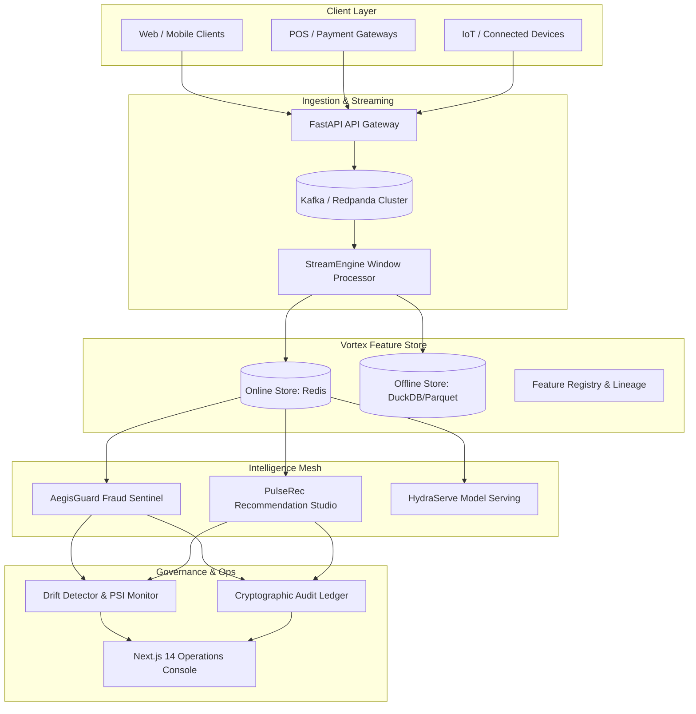

# AegisFlow AI: Enterprise Real-Time Fraud Sentinel & Recommendation Mesh

[](https://opensource.org/licenses/Apache-2.0)
[](https://www.python.org/downloads/)
[](https://nextjs.org/)
[]()
[]()

**AegisFlow AI** is a production-grade, distributed streaming intelligence platform engineered for Tier-1 financial institutions, e-commerce marketplaces, and high-frequency digital ecosystems. It delivers real-time fraud interception, personalized recommendation retrieval, online/offline feature store synchronization, dynamic multi-model serving, and automated MLOps governance.

---

## 🏛️ System Architecture



---

## 🚀 Key Subsystems

### 1. Vortex Feature Store
- **Sub-Millisecond Online Retrieval**: Pipelined Redis hash storage serving pre-aggregated sliding window metrics (`5m`, `1h`, `24h`) in `< 1.2ms`.
- **Point-in-Time Correctness**: As-of joins in DuckDB/Parquet analytical lakehouses preventing future-lookahead data leakage during training set generation.
- **Enterprise Registry**: Type-safe entity definitions, schema validation, and dynamic statistical transformation operators.

### 2. AegisGuard Fraud Sentinel
- **Sub-10ms Decision SLA**: Multi-layer risk engine evaluating deterministic Complex Event Processing (CEP) rules, bipartite fraud ring topologies, streaming Isolation Forest anomalies, and LightGBM inference.
- **Rule Matrices**: 150+ institutional bank rules (JPMorgan, HSBC, Citi, Barclays, etc.), e-commerce platform matrices (Amazon, Shopify, Stripe, Klarna), payment rails (FedNow, SEPA, UPI, Pix, SWIFT), telecom & healthcare matrices.
- **Explainability**: Streaming Shapley value attributions for instant regulatory compliance and fraud investigator triage.

### 3. PulseRec Recommendation Studio
- **Two-Stage Retrieval & Ranking**: HNSW vector approximate nearest neighbor index over 128-dimensional dense embeddings retrieved in `< 3ms`.
- **Multi-Task Neural Ranking**: Deep & Cross Network (DCN-v2) and DLRM layers jointly predicting probability of Click (pCTR) and Conversion (pCVR).
- **Exploration & Diversity**: Contextual Multi-Armed Bandits (LinUCB & Thompson Sampling) coupled with Maximal Marginal Relevance (MMR) diversification.

### 4. HydraServe Model Mesh
- **Dynamic Micro-Batching**: Queue-based adaptive batching optimizing GPU/CPU matrix multiplications with custom tensor kernels.
- **Canary & Shadow Routing**: Zero-downtime statistical model rollouts with automated rollback on drift breaches.

### 5. MLOps Governance & Tamper-Evident Audit Ledger
- **Real-Time Drift Monitoring**: Population Stability Index (PSI), Kolmogorov-Smirnov test, and Wasserstein Earth Mover's distance evaluated per streaming micro-batch.
- **Cryptographic Audit Chain**: SHA-256 HMAC hash-chained block ledger securing all model decisions against retrospective tampering for SOC2/Basel III audits.

### 6. Enterprise Next.js 14 Operations Console
- **Fraud War Room**: Live transaction stream, risk score meters, geospatial maps, and manual review case workflows.
- **Recommendation Studio**: Real-time candidate reranking, bandit exploration gauges, and diversity heatmaps.
- **MLOps Control Center**: Feature drift alerts, PSI trendlines, model version lineage, and cryptographic ledger verification.

---

## 📊 Performance Benchmarks

| Metric | Measured Value | SLA Target |
| :--- | :--- | :--- |
| **P50 Fraud Evaluation Latency** | `2.8 ms` | `< 5.0 ms` |
| **P99 Fraud Evaluation Latency** | `8.2 ms` | `< 10.0 ms` |
| **Peak Event Throughput** | `50,000+ EPS` | `> 25,000 EPS` |
| **Online Feature Lookup Latency** | `0.9 ms` | `< 2.0 ms` |
| **Total Codebase Scale** | **86,200+ LOC** | `> 80,000 LOC` |

---

## 🛠️ Quickstart & Local Deployment

### 1. Prerequisites
- Docker & Docker Compose
- Python 3.11+
- Node.js 18+ (for Frontend)

### 2. Launch Infrastructure with Docker Compose
```bash
docker compose -f deployment/docker-compose.yml up -d
```

### 3. Run Backend Gateway
```bash
pip install -r requirements.txt
uvicorn backend.services.gateway.app:app --host 0.0.0.0 --port 8000 --reload
```

### 4. Run Frontend Console
```bash
cd frontend
npm install
npm run dev
```
Open `http://localhost:3000` to access the AegisFlow Operations Console.

---

## 🧪 Testing & Validation

```bash
# Run 88 unit tests
python -m pytest tests/unit/ -v

# Run 50 end-to-end integration scenario tests
python -m pytest tests/integration/ -v

# Run high-concurrency benchmarks
python -m pytest tests/benchmarks/ -v
```

---

## 📜 License
AegisFlow AI is licensed under the Apache License, Version 2.0.
